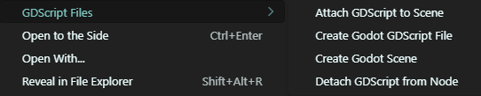

# Godot-create-files

**Godot-create-files** is a VS Code extension that helps you quickly create and manage Godot `.gd` scripts and `.tscn` scene files directly from the file explorer.

## 🚀 Features

- 📄 Create new GDScript files with a selected `extends` base class.
- 🔗 Attach a `.gd` script to a node inside a `.tscn` scene.
- ❌ Detach a script from a node.
- 🎭 Create new `.tscn` scene files with a chosen root node type (e.g., `Node3D`, `CharacterBody3D`, etc.).
- 👆 All actions are available via right-click context menu in the explorer.

## 📂 How to Use

1. Right-click on a folder in the VS Code file explorer.
2. Select an action under the **GDScript Files** submenu:
   - `Create Godot GDScript File`
   - `Attach GDScript to Scene`
   - `Detach GDScript from Node`
   - `Create Godot Scene`

## ⚙️ Requirements

- VS Code `^1.102.0` or higher.
- A Godot project structure with `.gd` and `.tscn` files.

## 🔐 Notes

Each created `.gd` script is accompanied by a `.uid` file that stores a unique identifier. This UID is used for referencing the script inside `.tscn` files.

## 🧪 Status

This extension is under active development. Bugs or limitations may occur. Contributions and feedback are welcome!

